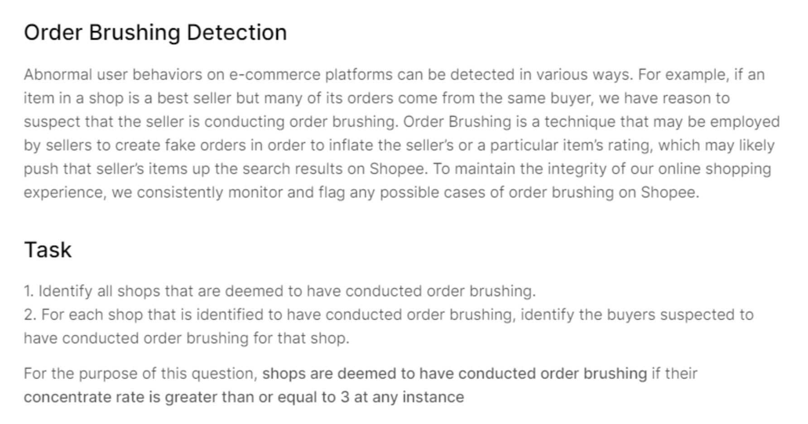

# Order-Brushing
My entry for Week 1 of the Shopee Code League competition.  
The data used as input was given in "order_brush_order.csv"

More details about the problem can be found in the **problem** folder.

Honestly not sure if the algorithm I wrote is that efficient...  
It takes around 45 to 50 seconds for it to complete its execution on my laptop...  
But it works...
